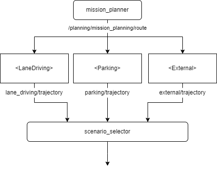

# Autoware.universe with External Planner

本リポジトリは、[Autoware.universe](https://github.com/autowarefoundation/autoware_universe) をベースに、外部のカスタムプランナー（`External Planner`）への切り替え機能を追加したリポジトリです。

Autoware.universe に標準で提供されている `LaneDriving` や `Parking` では対応が難しい自律走行シナリオに対して、独自のプランニングアルゴリズムを組み込めるようにすることを目的としています。

> [!CAUTION]
> なお、`External Planner`本体は本リポジトリには含まれておらず、別途実装する必要があります。

## 概要

これまでのAutoware.universe では、自動運転のための様々なPlanning機能が提供されており、レーン走行や駐車などのシナリオに対応しています。

一方で、標準で提供されているPlannerでは対応が難しく、用途に応じた独自のプランニングアルゴリズムが必要となるケースがあります。

本リポジトリでは、AutowareのPlanningシステムに `ExternalPlanner` Scenarioを追加し、外部で実装したカスタムPlannerを利用できるようにしています。

External Plannerへの切り替えは、車両位置とVectorMap上に定義された `external_area` を利用して自動的に行われます。

### 想定ユースケース

External Plannerの仕組みは、例えば以下のような用途を想定しています。

* 特殊な自動運転走行動作
* 新しいPlanningアルゴリズムの研究・開発
* 独自開発したPlannerのAutowareへの統合
* Autoware標準Plannerでは実現が難しい走行シナリオ

### ノード構成


## 追加した主な機能

本リポジトリでは、以下の機能を追加しています。

* `LaneDriving` および `Parking` 以外のカスタムPlannerへの対応
* `external_area` に基づいたExternal Scenarioへの自動切り替え
* ROSパラメータによる使用するカスタムPlannerパッケージの指定
* 車両停止後にExternal Plannerへ切り替えるSafe Mode
* External PlannerのTrajectoryと `LaneDriving` のTrajectoryを接続する機能
* Trajectory接続時の速度指令の平滑化機能
* External Plannerからの完了通知

## External Plannerへの切り替え

External Plannerは、VectorMapに定義された `external_area` を基準として選択されます。

```text
Vehicle
   |
   | external_areaへ接近
   v
+------------------+
| Scenario Selector|
+--------+---------+
         |
         | switch
         v
+------------------+
| External Scenario|
+--------+---------+
         |
         v
+------------------+
| External Planner |
+------------------+
```

`scenario_selector` は、車両の進行方向に対して `external_area` を検索します。

車両が切り替え条件を満たすと、標準のPlanning ScenarioからExternal Scenarioへ切り替わります。

## 設定

### External Plannerを有効にする

External Plannerの機能は、以下のLaunchファイルから有効化できます。

```text
launch/tier4_planning_launch/launch/scenario_planning/scenario_planning.launch.xml
```

以下のパラメータを設定します。

```yaml
use_external: true
```

External Plannerを使用する場合は、使用するPlannerパッケージを以下のパラメータで指定します。

```yaml
external_planner_name: <your_external_planner_package>
```

例えば、

```yaml
use_external: true
external_planner_name: my_external_planner
```

と設定します。

`use_external` が `false` の場合、External PlannerパッケージはLaunchされません。

### Vector Mapへのexternal_areaの設定仕方
以下の手順に従って、設定してください。📖[設定手順はこちら](./docs/assets/images/README_ExternalArea.md)


### 追加したパラメータ

#### `scenario_selector`

| Parameter                    | Type     | Default | Description                                                                |
| ---------------------------- | -------- | ------- | -------------------------------------------------------------------------- |
| `search_limit`               | `double` | `30.0`  | 進行方向に対して `external_area` を検索する距離 [m] |
| `area_margin_length`         | `double` | `0.5`   | 車両が `external_area` に確実に進入するためにLaneDriving Trajectoryへ付加する距離 [m] |
| `th_old_trajectory_time_sec` | `double` | `30.0`  | External TrajectoryへLaneDriving Trajectoryを接続する際に使用する既存Trajectoryの有効時間 [s] |
| `use_safe_mode`              | `bool`   | `true`  | `true`の場合、車両停止後にExternal Plannerへ切り替える |
| `use_external`               | `bool`   | `true`  | External Planner機能の有効／無効 |
| `use_external_extend`        | `bool`   | `false` | External PlannerのTrajectoryにLaneDriving Trajectoryを接続する |
| `use_smooth_extend`          | `bool`   | `false` | Trajectory接続時の速度指令を平滑化する |

#### `scenario_planning.launch.xml`

| Parameter               | Type     | Default            | Description                              |
| ----------------------- | -------- | ------------------ | ---------------------------------------- |
| `use_external`          | `bool`   | `false`            | `true`の場合、External PlannerパッケージをLaunchする |
| `external_planner_name` | `string` | `external_planner` | External Plannerのパッケージ名 |

## 依存関係

External Plannerとの連携に必要なMessage定義が別途必要です。

以下のPull Requestを参照してください。

* [Toyota/tier4_autoware_msgs#1](https://github.com/Toyota/tier4_autoware_msgs/pull/1)

## インストール

基本的な環境構築については、Autoware.universeの標準的なインストール手順に従ってください。

Autoware.universeの環境構築後、本リポジトリおよび必要な依存リポジトリをBuildしてください。

Autoware.universeの環境構築・インストールについては、以下を参照してください。

* [Autoware Documentation](https://autowarefoundation.github.io/autoware-documentation/)
* [Autoware Universe Documentation](https://autowarefoundation.github.io/autoware_universe/)

## ライセンス

本プロジェクトは、元のAutoware.universeプロジェクトのライセンスに従います。
詳細については [LICENSE](LICENSE) を参照してください。

## コントリビューション

本プロジェクトに関心をお持ちいただきありがとうございます。
現在、外部からのPull Requestを受け付けるための体制・ガイドラインを整備中です（2026年内に開始予定）。
それまでの間は、バグ報告や機能要望についてはIssueでお知らせいただけると助かります。

## 開発・保守メンバー

本プロジェクト は現在、以下のメンバーによって開発・保守されています。

* 宮原 康晃（トヨタ自動車㈱）
* 橋本 直也（トヨタ自動車㈱）
* 高橋 俊（トヨタ自動車㈱）
* 谷崎 大地（トヨタ自動車㈱）

## お問い合わせ

バグ報告や機能要望については、Issue を作成してください。
内容を確認のうえ、可能な範囲で対応いたします。
