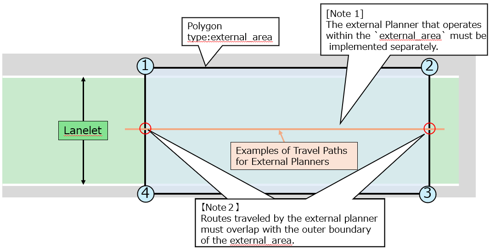

# external_area

## Detailed Requirement
Place a Polygon (type: external_area) in the section where you want to switch to an external custom planner (`External Planner`).

## Behavior in Autoware
When External Planner is enabled in Autoware, the autonomous vehicle will perform a temporary stop when the vehicle's baselink position enters the external_area, and the system will switch from `LaneDriving` or `Parking` to the `External Planner`.

Similarly, when exiting the external_area, the vehicle will perform a temporary stop and planning will switch back to `LaneDriving` or `Parking`.

## Notes
- The route driven by the external planner should overlap with the external_area’s outer boundary line.
- The map author should discuss with the requester to decide where planning should be switched.

## Recommended Vector Map
