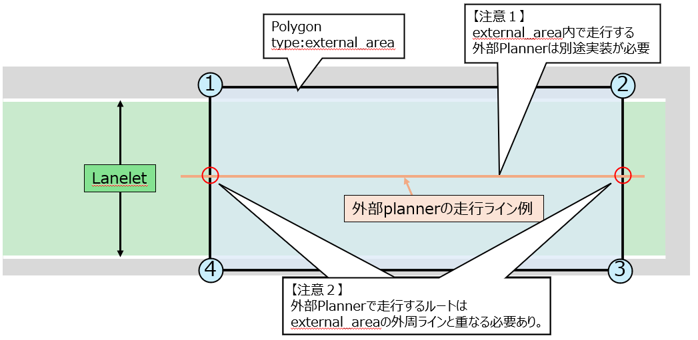

# external_area

## 要求の詳細
外部のカスタムプランナー（`External Planner`）へ切り替えしたい区間において、
Polygon(type:external_area)を配置すること。

## Autowareの振る舞い
Autowareでは、External Plannerを有効にした際、
自動運転車両のBaselink位置がexternal_area内に入った際、一時停止を行い、
 `LaneDriving` や `Parking`から`External Planner`へと切り替えを行う。 
また、external_areaから出る際に、一時停止を行い、`LaneDriving` や `Parking`へプランニングを切り替える。

## 補足
- 外部Plannerで走行するルートはexternal_areaの外周ラインと重なねること
- 地図製作者は、「どこでプランニングを切り替えるべきか」を依頼者と協議して決めること

## 望ましいVector Map
