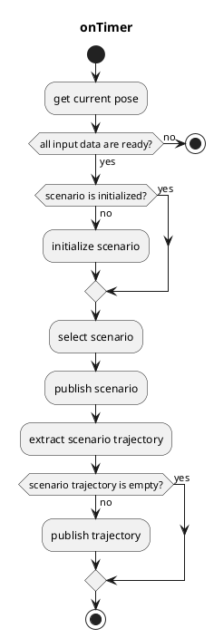
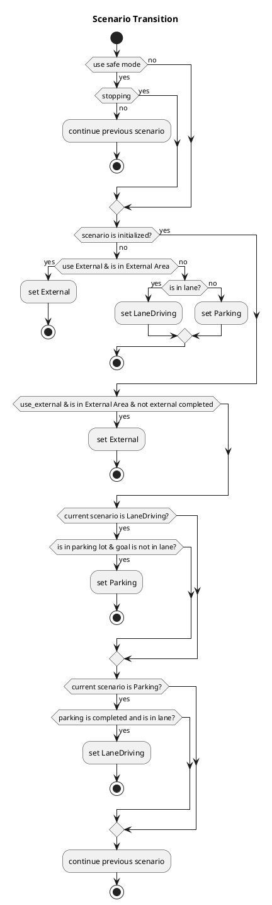

# scenario_selector

## scenario_selector_node

`scenario_selector_node` is a node that switches trajectories from each scenario.

### Input topics

| Name                             | Type                                    | Description                                           |
| -------------------------------- | --------------------------------------- | ----------------------------------------------------- |
| `~input/lane_driving/trajectory` | autoware_auto_planning_msgs::Trajectory | trajectory of LaneDriving scenario                    |
| `~input/parking/trajectory`      | autoware_auto_planning_msgs::Trajectory | trajectory of Parking scenario                        |
| `~input/external/trajectory`     | autoware_auto_planning_msgs::Trajectory | trajectory of External scenario                       |
| `~input/lanelet_map`             | autoware_auto_mapping_msgs::HADMapBin   |                                                       |
| `~input/route`                   | autoware_planning_msgs::LaneletRoute    | route and goal pose                                   |
| `~input/odometry`                | nav_msgs::Odometry                      | for checking whether vehicle is stopped               |
| `is_parking_completed`           | bool (implemented as rosparam)          | whether all split trajectory of Parking are published |
| `is_external_completed`          | bool (implemented as rosparam)          | whether External planner is finished                  |

### Output topics

| Name                 | Type                                    | Description                                    |
| -------------------- | --------------------------------------- | ---------------------------------------------- |
| `~output/scenario`   | tier4_planning_msgs::Scenario           | current scenario and scenarios to be activated |
| `~output/trajectory` | autoware_auto_planning_msgs::Trajectory | trajectory to be followed                      |

### Output TFs

None

### How to launch

1. Write your remapping info in `scenario_selector.launch` or add args when executing `roslaunch`
2. `roslaunch scenario_selector scenario_selector.launch`
   - If you would like to use only a single scenario, `roslaunch scenario_selector dummy_scenario_selector_{scenario_name}.launch`

### Parameters

{{ json_to_markdown("planning/scenario_selector/schema/scenario_selector.schema.json") }}

### Flowchart

### Additional 
**Add external planner** 

* External planner is activated in polygon with "external_area" type in VectorMap
* Set `use_exernal`=false if you don't use external planner
* `~input/external/trajectory` is subscribed and publish to control node in external area, until `is_external_completed` topic is subscribed

**Cut lane trajectory for external**

* Cut trajectory at boundary between lane and external region in `safe_mode`=true to stop there
* Only activate at Lane → External (not activate at Lane → Parking) 
* `area_margin_length` is parameter of intruding length for exrernal area. This should be greater than 0 for proper scenario transition
* `search_limit` is a forward distance, from current position, to search external area in lane driving

**Extend external trajectory (not recommended)**

* Extend trajectory at boundary between external and lane region in `safe_mode`=false and `use_external_extend`=true, to prevent stopping there
* Last trajectory of lane planning is recorded when scenario change Lane → External.   
Then part of that trajectory is jointed at the end of external trajectory if some condition is satisfied
   * Last lane trajectory's time stamp is newer than `th_old_trajectory_time_sec` times ago from now
   * There is a near trajectory point in lane trajectory to the last point of external trajectory.  
     (distance is smaller than 1m and yaw angle  is smaller than pi/2) 
* Joint point of trajectory is smoothed when `use_smooth_extend`=true
* Since usage of this process(Extend external trajectory) is limited, extend trajectory in external planner is recommended.
